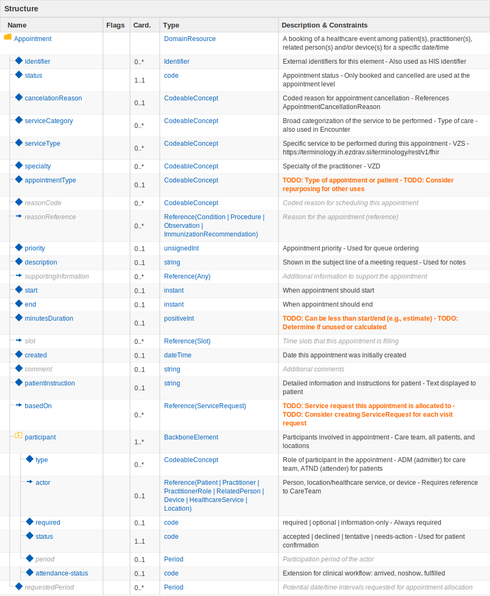

# FHIR Resource SVG Renderer

Go web service that renders FHIR ResourceDefinition structures as SVG diagrams.



## Usage

```bash
# Build and run
go build -o fhir_renderer
./fhir_renderer

# Or run directly
go run main.go
```

Server starts on port 8080 (configurable via `PORT` env var).

## API Endpoints

| Method | Path | Description |
|--------|------|-------------|
| GET | `/health` | Health check |
| GET | `/help` | API documentation |
| GET | `/example` | Example JSON schema |
| GET | `/render?resource={compressed}` | Render Brotli+Base64URL compressed JSON to SVG |
| POST | `/render` | Render JSON body to SVG |
| POST | `/compress` | Compress JSON to Brotli+Base64URL |
| POST | `/decompress` | Decompress Brotli+Base64URL to JSON |

## URL Compression

Links use Brotli compression + Base64URL encoding for ~60-70% size reduction.

**Format:** `/render?resource={brotli-base64url-json}`

The editor's "Copy SVG Link" button creates compressed links. Use "Import Link" to load JSON from a compressed link.

## Example

```bash
curl -X POST http://localhost:8080/render \
  -H "Content-Type: application/json" \
  -d '{"name":"Patient","type":"DomainResource"}'
```

## JSON Schema

See `/help` endpoint for full schema documentation.

Minimal valid JSON:
```json
{"name": "MyResource", "type": "DomainResource"}
```
